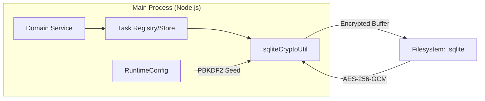

# Prana — Electron Runtime Library & Host Application Shell

**Version 1.3.0** · Electron + TypeScript · MVVM Renderer · SQLite + Hardened Vault Persistence (AES-256-GCM)

Prana is a standalone desktop runtime library that provides orchestration, persistence, context management, security, and UI infrastructure for intelligent agent-driven applications. It ships as an Electron application shell that can be consumed by a host app today (e.g. **Dhi**) and extended to additional host apps over time.

> **Canonical documentation lives in [`docs/features/index.md`](docs/features/index.md).**
> Each atomic document owns one runtime responsibility and one reason to change.

---

## Table of Contents

- [Architectural Philosophy](#architectural-philosophy)
- [System Architecture Overview](#system-architecture-overview)
- [Repository Layout](#repository-layout)
- [Core Runtime Contracts](#core-runtime-contracts)
  - [Virtual Drive Layer](#virtual-drive-layer)
  - [Vault — Encrypted Durable Archive](#vault--encrypted-durable-archive)
  - [SQLite Cache — Hot Operational State](#sqlite-cache--hot-operational-state)
  - [Encryption Service](#encryption-service)
  - [Runtime Doctor — Post-Bootstrap Diagnostics](#runtime-doctor--post-bootstrap-diagnostics)
  - [Vaidyar — Runtime Integrity Engine & Dashboard](#vaidyar--runtime-integrity-engine--dashboard)
- [Runtime Systems](#runtime-systems)
  - [Startup Orchestrator & Splash Initialization](#startup-orchestrator--splash-initialization)
  - [Props Config Principle (Cold-Vault Bootstrap)](#props-config-principle-cold-vault-bootstrap)
  - [Sync Protocol & Vault Sync Contract](#sync-protocol--vault-sync-contract)
  - [Data Integrity Protocol](#data-integrity-protocol)
  - [Cron Recovery Contract](#cron-recovery-contract)
  - [Task Scheduler & Universal Queue System](#task-scheduler--universal-queue-system)
  - [Context Optimization & Chat Context Rotation](#context-optimization--chat-context-rotation)
  - [Channel Integration](#channel-integration)
  - [Email Subsystem](#email-subsystem)
  - [Google Ecosystem Integration](#google-ecosystem-integration)
  - [In-App Agent Chat](#in-app-agent-chat)
  - [Notification Centre](#notification-centre)
  - [Visual Identity Engine](#visual-identity-engine)
  - [Onboarding & Registry Governance](#onboarding--registry-governance)
  - [Infrastructure Layers](#infrastructure-layers)
  - [Master Spec](#master-spec)
- [Storage Governance (Multi-App Ready)](#storage-governance-multi-app-ready)
- [UI Screen Inventory](#ui-screen-inventory)
- [Audit Layer](#audit-layer)
- [Security Model Summary](#security-model-summary)
- [Known Architectural Gaps](#known-architectural-gaps)
- [Build, Run, and Test](#build-run-and-test)
- [Contribution Workflow](#contribution-workflow)
- [Integration Boundaries](#integration-boundaries)
- [Quick Navigation](#quick-navigation)

---

## Architectural Philosophy

Prana is built around four governing principles:

1. **Atomic Documentation First** — One document, one runtime responsibility. Every module contract in `docs/features` defines scope boundaries with explicit "It does / It does not" clauses, dependency lists, implementation references, and known gaps.

2. **Service-Oriented Main Process** — The Electron main process hosts ~100+ TypeScript services covering storage, sync, orchestration, security, email, AI context management, channel routing, and diagnostics. All state flows through structured IPC; the renderer never directly accesses filesystem or SQLite.

3. **MVVM-Oriented Renderer** — Every UI screen follows a Container → ViewModel → View composition. Containers wire IPC, ViewModels hold state logic, Views are pure presentation. This ensures predictable, testable UI behavior.

4. **Docs-First Implementation** — Major cross-cutting changes begin with a documentation PR. Storage contracts, runtime behaviors, and audit notes are agreed upon before code is written. This is enforced through the atomic docs tree and storage PR workflow.

---

## System Architecture Overview

```
┌─────────────────────────────────────────────────────────────────────┐
│                        HOST APPLICATION (Dhi)                       │
│                   Seeds PranaRuntimeConfig via IPC                  │
│                  during splash-screen bootstrap phase               │
└──────────────────────────────┬──────────────────────────────────────┘
                               │ app:bootstrap-host IPC
┌──────────────────────────────▼──────────────────────────────────────┐
│                       PRANA MAIN PROCESS                            │
│                                                                     │
│  ┌──────────────┐  ┌──────────────┐  ┌───────────────────────────┐ │
│  │   Startup    │  │    IPC       │  │  Runtime Config Service   │ │
│  │ Orchestrator │──│   Service    │──│  (Cold-Vault Bootstrap)   │ │
│  └──────┬───────┘  └──────────────┘  └───────────────────────────┘ │
│         │                                                           │
│  ┌──────▼───────────────────────────────────────────────────────┐  │
│  │                    SERVICE LAYER (~100+ services)            │  │
│  │                                                              │  │
│  │  Storage:  driveController · vault · sqliteConfigStore ·     │  │
│  │            runtimeDocumentStore · mountRegistry · cryptoUtil   │  │
│  │  Sync:     syncProvider · syncEngine · syncStore ·           │  │
│  │            conflictResolver · transactionCoordinator          │  │
│  │  Auth:     authStore · authService                           │  │
│  │  Email:    emailOrchestrator · emailBrowserAgent ·           │  │
│  │            piiRedactor · cronScheduler                        │  │
│  │  Context:  contextEngine · contextOptimizer ·                │  │
│  │            contextDigestStore · tokenManager                  │  │
│  │  Agents:   orchestrationManager · channelRouter ·            │  │
│  │            protocolInterceptor · agentExecution · queue       │  │
│  │  Google:   googleBridge (Docs/Sheets/Forms) · OAuthServer     │  │
│  │  Infra:    systemHealth · hookSystem · pdfGenerator           │  │
│  │  Security: AES-256-GCM (vault/drive/auth/sqlite-cache)        │  │
│  └──────────────────────────────────────────────────────────────┘  │
│                                                                     │
│  ┌────────────────────┐    ┌────────────────────┐                  │
│  │   System Drive     │    │   Vault Drive      │                  │
│  │ (SQLite hot cache) │    │ (encrypted archive) │                  │
│  │ Auto-mount at boot │    │ On-demand mount     │                  │
│  └────────────────────┘    └────────────────────┘                  │
└──────────────────────────────┬──────────────────────────────────────┘
                               │ Preload Bridge (contextBridge)
┌──────────────────────────────▼──────────────────────────────────────┐
│                      PRANA RENDERER (React/MUI)                     │
│                                                                     │
│  Splash → Login → Onboarding → Main Layout                        │
│  ├── Vault Screen              ├── Infrastructure Screen           │
│  ├── Vault Knowledge Screen    ├── Integration Verification        │
│  ├── Vault Knowledge Repo      ├── Viewer (Markdown / PDF)        │
│  ├── Onboarding (multi-step)   └── Director Interaction Bar       │
│  └── Auth (Login / Forgot / Reset / Access Denied)                 │
└─────────────────────────────────────────────────────────────────────┘
```

---

## Repository Layout

```text
src/
  main/
    index.ts                       # Electron lifecycle, window management
    preload.ts                     # contextBridge IPC surface
    services/                      # ~100+ runtime services
      agents/                      # Agent implementations
      types/                       # Shared service type definitions
  ui/
    main.tsx                       # React mount point
    authentication/                # Login, Forgot/Reset Password, Access Denied
    splash/                        # Bootstrap status & readiness gate
    splash-system-initialization/  # System-level startup surface
    onboarding/                    # Registry setup wizard
    onboarding-channel-configuration/
    onboarding-model-configuration/
    onboarding-registry-approval/
    vault/                         # Vault content operations & publish
    vault-knowledge/               # Knowledge browsing
    vault-knowledge-repository/    # Committed knowledge projection
    vault-folder-structure/        # Vault folder UI surface
    infrastructure/                # Runtime telemetry & diagnostics
    infrastructure-layers/         # Layered infrastructure view
    integration/                   # Integration verification page
    viewer-markdown/               # Markdown document viewer
    viewer-pdf/                    # PDF document viewer
    components/                    # Shared components (DirectorInteractionBar, etc.)
    shared-components/             # Cross-screen shared UI components
    layout/                        # MainLayout shell
    hooks/                         # Custom React hooks
    context/                       # React context providers
    state/                         # State management
    constants/                     # Config constants (pranaConfig, etc.)
    common/                        # Common utilities
    repo/                          # Repository-related UI
  services/                        # Cross-layer shared services

docs/
  modules/
    index.md                       # Atomic documentation index
    audit/                         # Implementation-to-doc mismatch audits
    storage/                       # Multi-app storage governance contracts
    ui/                            # Per-screen atomic UI contracts
    *.md                           # Individual module contracts (~35 files)
  module/                          # Legacy bridge/reference docs
  core/                            # Core architecture notes
  system/                          # System-level documentation
  integration_guide/               # Integration reference material
  reference/                       # Additional reference docs

config/                            # Build & environment configuration
tests/                             # E2E test suites (Playwright)
```

---

## Core Runtime Contracts

### Virtual Drive Layer

**Document:** [`virtual-drive.md`](docs/features/storage/virtual-drive.md)
**Service:** `driveControllerService.ts` · `mountRegistryService.ts`

The virtual drive layer manages encrypted mount points that provide at-rest protection for runtime data files.

- **System Drive** — Automatically mounted at bootstrap via `initializeSystemDrive()`. Provides the encrypted storage root for SQLite hot-cache files. Falls back to a local app-data path if encrypted mount setup is unavailable.
- **Vault Drive** — Mounted on demand via `mountVaultDrive()` / `unmountVaultDrive()` when vault sync or write-back operations require archive access.
- **Mount Registry** — Tracks mount state, failures, and resolved mount-point paths for diagnostic reporting.

**Known gaps:** Vault mount/unmount is not yet automatically orchestrated around sync windows. Host shutdown does not enforce `driveControllerService.dispose()`. The fallback path provides degraded security posture.

---

### Vault — Encrypted Durable Archive

**Document:** [`vault.md`](docs/features/storage/vault.md) · [`vault-folder-structure.md`](docs/features/storage/vault-folder-structure.md) · [`vault-knowledge-repository.md`](docs/features/storage/vault-knowledge-repository.md)
**Service:** `vaultService.ts` · `vaultLifecycleManager.ts` · `governanceRepoService.ts` · `memoryIndexService.ts`

Vault is the encrypted durable archive. It stores commit-ready knowledge and approved content that must survive across sessions.

- Archives use **AES-256-GCM** with **PBKDF2-derived keys**.
- A temporary working workspace is hydrated from the encrypted archive only when vault operations require it, then cleaned up via `cleanupTemporaryWorkspace(true)`.
- Vault publish is explicit and gated by user approval.
- The vault folder structure defines staging, raw, and DCM metadata directories, with clear separation between archive storage and temporary workspace.
- The **Vault Knowledge Repository** provides a user-facing projection for browsing committed and staged knowledge artifacts.

**Known gaps:** Mount-level vault locking is not yet enforced for every runtime path. Some write-back behavior uses temporary workspace semantics instead of strict mount-scoped transactions.

---

### SQLite Cache — Hot Operational State

**Document:** [`sqlite-cache.md`](docs/features/storage/sqlite-cache.md)
**Services:** `runtimeDocumentStoreService.ts` · `sqliteConfigStoreService.ts` · `contextDigestStoreService.ts` · `emailKnowledgeContextStoreService.ts` · `governanceLifecycleQueueStoreService.ts` · `authStoreService.ts`

SQLite is the hot operational cache for all mutable runtime state. In v1.3, these databases are **encrypted at rest** independently of the mount state.



| Domain | What It Stores |
|---|---|
| Runtime Config | Bootstrap configuration snapshots (Cold-Vault model) |
| Runtime Documents | Operational documents and staged records |
| Email | Intake records, draft state, batching, knowledge context |
| Auth | Local credential hashes, recovery state |
| Context | Digest store for conversation context optimization |
| Governance | Lifecycle queue for onboarding and registry approval |
| Cron | Scheduler state, job history, recovery queue |

- Files are exported via `sql.js`, encrypted via AES-256-GCM, and stored under the system drive root.
- Runtime documents are maintained as a write-through cache that can flush to vault-backed state.
- Email knowledge context uses a dedicated store with retention cleanup.
- App-specific cache mappings are defined in [`docs/features/storage/governance/cache`](docs/features/storage/governance/cache).


---

### Encryption Service

**Document:** [`encryption-service.md`](docs/features/storage/encryption-service.md)
**Services:** Distributed across `vaultService.ts` · `driveControllerService.ts` · `authStoreService.ts` · `runtimeConfigService.ts`

The encryption model covers three areas:

1. **Vault Archive Encryption** — AES-256-GCM with PBKDF2-derived keys. Password salts and archive settings come from runtime bootstrap configuration.
2. **Local Auth Hashing** — Credential hashes stored in SQLite, never synced to vault.
3. **Secure Mount Handshakes** — Drive controller negotiates mount-point encryption with platform runtime configuration.

**Known gaps:** Encryption is distributed across services rather than centralized. Security posture depends on the drive layer for SQLite at-rest protection. No dedicated key-rotation workflow exists.

---

### Runtime Doctor — Post-Bootstrap Diagnostics

**Document:** [`prana-doctor.md`](docs/features/boot/prana-doctor.md)
**Service:** `systemHealthService.ts` (partial implementation)

The Runtime Doctor is designed as an optional, pluggable diagnostic module that runs after bootstrap to verify system integrity:

| Layer | Checks |
|---|---|
| **Storage** | System-drive mount state, vault archive readability, SQLite accessibility |
| **Security** | SSH key/repo access, encryption handshakes, local auth store health |
| **Integration** | Google ecosystem connectivity, browser automation driver, email IMAP readiness, cron scheduler coherence |

The Doctor produces a structured report with overall status, per-check results, and failure hints. It distinguishes degraded startup from hard blocks and is designed for both on-demand and post-startup execution.

**Known gaps:** `systemHealthService` currently reports OS/process health only — it is not yet the full Doctor registry. No unified Doctor runtime service exists. Browser, email, Google, and mount checks still need a single orchestrated report surface.

---

### Vaidyar — Runtime Integrity Engine & Dashboard

**Document:** [`vaidyar.md`](docs/features/vaidyar/vaidyar.md)
**Services:** `vaidyarService.ts` · `systemHealthService.ts`

Vaidyar acts as the authoritative health system of the runtime, providing continuous evaluation and visual verification ensuring system integrity:

- **Diagnostic Registry** — Modular, independently executable checks grouped by layer (Storage, Security, Network, Cognitive).
- **Health Classification** — Assigns statuses (Healthy, Degraded, Blocked), capable of gating Startup Orchestrator based on critical failures.
- **Continuous Monitoring** — Supports bootstrap checks, runtime periodic pulses, and on-demand execution.
- **Dashboard Surface** — Real-time MVVM-based visual verification of health, blocking status, and failure remediation hints via `IntegrationVerificationPage.tsx`.

**Known gaps:** No continuous background heartbeat worker, lack of auto-recovery hooks tied to orchestrator, and no raw deep log inspection UI.

---

## Runtime Systems

### Startup Orchestrator & Splash Initialization

**Documents:** [`startup-orchestrator.md`](docs/features/boot/startup-orchestrator.md) · [`splash-system-initialization.md`](docs/features/splash/splash-system-initialization.md)
**Service:** `startupOrchestratorService.ts`

The startup sequence follows a strict **fail-fast, IPC-driven** bootstrap model:

1. **Host seeds configuration** — The host app (e.g. Dhi) sends `PranaRuntimeConfig` via the `app:bootstrap-host` IPC handler during the splash screen phase.
2. **Runtime config validation** — `runtimeConfigService` validates the payload and persists it to SQLite (`runtime_config_meta`).
3. **System drive mount** — `driveControllerService.initializeSystemDrive()` resolves the encrypted storage root.
4. **Sync & recovery stages** — `startupOrchestratorService` calls sync and recovery services in order, reporting status at each stage.
5. **Readiness signal** — Bootstrap status is reported to the splash UI, which transitions to the application.

The system **stays blocked** until the splash screen provides configuration. If bootstrap fails, structured `BLOCKED` status reports and global exception broadcasting prevent white-screen crashes.

---

### Props Config Principle (Cold-Vault Bootstrap)

**Document:** [`props-config-principle.md`](docs/features/props-config-principle.md)
**Services:** `runtimeConfigService.ts` · `sqliteConfigStoreService.ts` · `pranaRuntimeConfig.ts`

Runtime configuration follows the **Cold-Vault** model:

- Runtime props are **bootstrap input only** — they seed SQLite-backed configuration snapshots and are never used as a long-term source of truth.
- Secret values are protected from being written into vault payloads.
- All configuration flows exclusively through structured IPC payloads; there is no direct `process.env` access.
- The `PranaRuntimeConfig` interface defines all required fields including branding, API endpoints, and integration keys, validated at bootstrap with fail-fast semantics.

---

### Sync Protocol & Vault Sync Contract

**Documents:** [`sync-protocol.md`](docs/features/storage/sync-protocol.md) · [`vault-sync-contract.md`](docs/features/storage/vault-sync-contract.md)
**Services:** `syncProviderService.ts` · `syncEngineService.ts` · `syncStoreService.ts` · `conflictResolver.ts` · `transactionCoordinator.ts`

The sync system reconciles local SQLite state with the vault-backed archive:

- **Pull** — Remote vault snapshots are fetched, validated for integrity, and merged into local SQLite projections.
- **Lineage tracking** — Sync lineage and snapshot integrity are tracked to resolve local-vs-remote freshness.
- **Conflict resolution** — `conflictResolver` records merge decisions with full audit trail.
- **Push** — Approved local runtime changes are written back to the vault through `transactionCoordinator`.

---

### Data Integrity Protocol

**Document:** [`data-integrity-protocol.md`](docs/features/storage/data-integrity-protocol.md)
**Services:** `dataFilterService.ts` · `diffEngine.ts` · `syncEngineService.ts`

Protects persisted runtime data from corruption or invalid merges:

- Validates snapshot integrity before sync merge.
- Prevents invalid remote payloads from becoming local state.
- Provides a basis for runtime cleanup and quarantine decisions.

**Known gap:** Integrity checks are strong at sync boundaries but not every runtime surface performs a comparable validation pass.

---

### Cron Recovery Contract

**Document:** [`cron-recovery-contract.md`](docs/features/cron/cron-recovery-contract.md)
**Service:** `cronSchedulerService.ts` · `governanceLifecycleQueueStoreService.ts`

Provides deterministic cron catch-up with duplicate prevention:

- Recovers missed jobs on startup.
- Prevents duplicate queueing across restart windows.
- Publishes scheduler telemetry for diagnostics.

---

### Task Scheduler & Universal Queue System

**Document:** [`queue-scheduling.md`](docs/features/queue-scheduling/queue-scheduling.md)
**Services:** `cronSchedulerService.ts` · `queueOrchestratorService.ts` · `taskRegistryService.ts`

Provides a deterministic, persistent, multi-lane task orchestration system:

- **Multi-Lane Isolation** — Segregates execution into Model (AI), Channel (External), and System (Cron) lanes to prevent concurrency starvation.
- **Persistent Task Registry** — Stores all task metadata in SQLite for crash recovery and bounded execution retries.
- **Execution Contract** — Ensures tasks are executed at least once safely with global/lane concurrency limits.

**Known gaps:** Lacks dynamic scaling (adaptive throttling) based on system metrics, no DAG task dependency chaining, and no remote distributed execution.

---

### Context Optimization & Chat Context Rotation

**Documents:** [`context-optimization.md`](docs/features/context/context-optimization.md) · [`chat-context-rotation.md`](docs/features/chat/chat-context-rotation.md)
**Services:** `contextEngineService.ts` · `contextOptimizerService.ts` · `contextDigestStoreService.ts` · `tokenManagerService.ts`

Manages intelligent context windowing for long-running AI conversations:

- **Split-buffer architecture** — Raw conversation history is stored separately from the actively sendable context window.
- **Token budget management** — `tokenManagerService` tracks budgets and threshold stages per model configuration.
- **Compaction** — When token budget is exceeded, older or evictable messages are compacted into summaries while preserving a raw audit trail.
- **Context extraction** — Optimized context is extracted for runtime model input, supporting both internal and channel-routed conversations.

**Known gaps:** No dedicated policy maps chat room lifecycle to context session rollover. No chat UI currently consumes compaction events or session preview hooks. Channel-aware retention rules across external vs. in-app conversations are not yet implemented.

---

### Channel Integration

**Document:** [`channel-integration.md`](docs/features/chat/channel-integration.md)
**Services:** `channelRouterService.ts` · `orchestrationManager.ts` · `protocolInterceptor.ts` · `registryRuntimeStoreService.ts`

Routes inbound messages from external communication channels into the orchestration pipeline:

- Accepts channel intents and maps them to orchestration work orders.
- Validates sender identity, channel authorization, and explicit persona targets.
- Attaches audit metadata for traceable intake records.
- **Telegram** is the currently implemented external adapter and is policy-gated.

**Known gaps:** No WhatsApp transport or webhook bridge. No shared channel identity reconciliation across external adapters. No dedicated channel inbox persists cross-channel conversations into SQLite.

---

### Email Subsystem

**Documents:** [`email-management.md`](docs/features/email/email-management.md) · [`email-orchestrator-service.md`](docs/features/email/email-orchestrator-service.md) · [`email-cron-heartbeat.md`](docs/features/email/email-cron-heartbeat.md) · [`email-draft-sync.md`](docs/features/email/email-draft-sync.md)
**Services:** `emailOrchestratorService.ts` · `emailKnowledgeContextStoreService.ts` · `emailBrowserAgentService.ts`

The email subsystem is a comprehensive pipeline with four distinct concerns:

| Concern | Responsibility |
|---|---|
| **Mailbox Management** | Account configuration, IMAP polling, cursor tracking, UID deduplication, triage |
| **Orchestration** | Intake processing, draft assembly, review gating, knowledge-context persistence |
| **Cron Heartbeat** | Per-account polling on configurable intervals, cron recovery catch-up, browser fallback for degraded Gmail |
| **Draft Sync** | Deterministic draft merge, contributor attribution, vault-backed storage of approved content |

**Critical design constraint:** Email sending is **intentionally blocked** by policy. All outbound mail requires human-confirmed handoff outside the library boundary. Draft operations are review-only.

---

### Google Ecosystem Integration

**Document:** [`google-ecosystem-integration.md`](docs/features/Integration/google-ecosystem-integration.md)
**Services:** `emailOrchestratorService.ts` · `emailBrowserAgentService.ts` · `googleBridgeService.ts`

Defines the integration boundary for Google-connected capabilities:

- Gmail-adjacent intake flows with IMAP/polling.
- Browser fallback for interactive login and session reuse.
- Future pluggable Google services contract.

**Known gap:** No unified Google API client/service exists yet. Current Gmail handling is mostly IMAP + browser fallback rather than a dedicated API integration layer.

---

### In-App Agent Chat

**Document:** [`in-app-agent-chat.md`](docs/features/chat/in-app-agent-chat.md)
**Services:** `orchestrationManager.ts` · `queueService.ts` · `channelRouterService.ts`
**UI:** `DirectorInteractionBar.tsx`

Provides a first-class in-app surface for operator-to-agent communication:

- User selects an agent target, submits a message to the correct work-order pipeline.
- Responses and queue state are presented back to the user.
- Currently functions as a routing bar, not a full chat workspace.

**Known gaps:** Chat history is not yet stored as a first-class SQLite conversation cache. No message threading, unread state, or agent-to-agent chat. No dedicated chat folder or transcript store in the source tree.

---

### Notification Centre

**Document:** [`notification-centre.md`](docs/features/notification/notification-centre.md)
**Services:** `hookSystemService.ts` · `systemHealthService.ts`

Surfaces system and workflow alerts:

- Consumes events emitted by service layers via the hook system.
- Presents actionable runtime notices to the user.
- Status changes and warnings are surfaced in real-time.

---

### Visual Identity Engine

**Document:** [`visual-identity-engine.md`](docs/features/visual/visual-identity-engine.md)
**Config:** `src/ui/constants/pranaConfig.ts`

Defines the visual branding contract for all runtime UI surfaces:

- Enforces brand fields and presentation tokens.
- Provides branding data to splash, main layout, and all screen families.
- Branding configuration is persisted in the `runtime_config_meta` SQLite table via the Cold-Vault model.

---

### Onboarding & Registry Governance

**Documents:** [`onboarding-channel-configuration.md`](docs/features/Onboarding/onboarding-channel-configuration.md) · [`onboarding-model-configuration.md`](docs/features/Onboarding/onboarding-model-configuration.md) · [`onboarding-registry-approval.md`](docs/features/Onboarding/onboarding-registry-approval.md) · [`onboarding-hybrid-explorer-governance-lifecycle.md`](docs/features/Onboarding/onboarding-hybrid-explorer-governance-lifecycle.md)
**Services:** `businessContextRegistryService.ts` · `businessAlignmentService.ts` · `businessContextValidationService.ts` · `registryRuntimeStoreService.ts` · `runtimeModelAccessService.ts`

The onboarding system is a multi-step governance pipeline:

1. **Channel Configuration** — Configure channels (Telegram, future WhatsApp) for routing and approval context.
2. **Model Configuration** — Select AI model provider, capture context-window metadata, persist to feed token budget services.
3. **Registry Approval** — Validate company/product context, ensure approval prerequisites, block incomplete states.
4. **Hybrid Explorer Governance** — Map cross-references across KPI, workflow, protocol, skill, and data input assets. Gate approval on cross-reference completeness and surface unresolved dependencies.

---

### Infrastructure Layers

**Document:** [`infrastructure-layers.md`](docs/features/boot/infrastructure-layers.md)
**Services:** `ipcService.ts` · All `src/main/services/*.ts`

Defines the clean separation between:

- **Main-process services** — Storage, sync, diagnostics operate as backend responsibilities.
- **Renderer views** — MVVM screens consume IPC data only.
- **Stable boundaries** — Modular expansion is enabled by service contracts without cross-layer coupling.

---

### Master Spec

**Document:** [`master-spec.md`](docs/features/master-spec.md)

The top-level contract for the library architecture. It defines closed-loop system boundaries, governs high-level runtime behavior and module ownership, and anchors all downstream module docs. It is a parent contract, not a per-feature implementation guide.

---

## Storage Governance (Multi-App Ready)

**Documents:** [`storage/index.md`](docs/features/storage/governance/index.md) · [`storage/rule.md`](docs/features/storage/governance/rule.md)

Storage is governed by five mandatory rules:

| Rule | Description |
|---|---|
| **R1: Vault Is Git Tree** | Vault is documented as a git-style tree rooted by app name, with subtree support for large branches |
| **R2: Cache Is SQLite Table Model** | Cache uses `app_registry` with `app_id` foreign keys for ownership |
| **R3: Mirror Constraint** | Cache-only is allowed. Vault-only is **forbidden**. Every vault domain must exist in cache |
| **R4: Domain-Key Stability** | Domain keys are contract identifiers, must remain stable. Renames require both files in one PR |
| **R5: PR Contract** | New app integration must submit docs first. Minimum: `storage/cache/<app>.md` |

**Current app registrations:**

| App | Cache Contract | Vault Contract | Mirrored Domains |
|---|---|---|---|
| **Prana** | [`cache/prana.md`](docs/features/storage/governance/cache/prana.md) | [`vault/prana.md`](docs/features/storage/governance/vault/prana.md) | `registry`, `knowledge_documents`, `email_artifacts`, `audit_exports` |

Cache also defines an extra cache-only domain: `session_only`.

**Compliance audit:** [`audit/storage-contract-audit.md`](docs/features/audit/storage-contract-audit.md)

---

## UI Screen Inventory

All screens follow the **Container → ViewModel → View** MVVM pattern. Atomic contracts for each screen are in [`docs/features/splash`](docs/features/splash).

| Screen Family | Screens | Purpose |
|---|---|---|
| **Splash** | SplashView, SplashContainer | Bootstrap progress, readiness gating, error messaging |
| **Authentication** | Login, Forgot Password, Reset Password, Access Denied | Local-only auth flow with SQLite-backed credential store |
| **Onboarding** | Onboarding, Model Configuration, Channel Configuration, Registry Approval | Multi-step registry setup and governance approval |
| **Vault** | Vault, Vault Knowledge, Vault Knowledge Repository | Content operations, knowledge browsing, publish workflow |
| **Infrastructure** | Infrastructure, Integration Verification | Runtime telemetry, crisis-mode state, pre-launch verification |
| **Viewers** | Markdown Viewer, PDF Viewer | Document rendering surfaces |
| **Main Layout** | MainLayout shell with DirectorInteractionBar | Navigation chrome and agent routing bar |

---

## Audit Layer

**Index:** [`audit/index.md`](docs/features/audit/index.md)

The audit layer tracks implementation-to-documentation mismatches. Each audit report identifies missing logic, code-doc deviations, security risks, and recommended fixes.

| Audit Report | Focus Area |
|---|---|
| [Persistence Architecture](docs/features/audit/persistence-architecture-audit.md) | Drive lifecycle, mount gaps, fallback security |
| [Storage Contract](docs/features/audit/storage-contract-audit.md) | Multi-app cache/vault compliance |
| [Virtual Drive](docs/features/audit/virtual-drive-audit.md) | Mount/unmount orchestration gaps |
| [Vault](docs/features/audit/vault-audit.md) | Archive operations, locking, workspace semantics |
| [SQLite Cache](docs/features/audit/sqlite-cache-audit.md) | DB-native encryption, migration coverage |
| [Encryption Service](docs/features/audit/encryption-service-audit.md) | Centralization, key rotation |
| [Prana Doctor](docs/features/audit/prana-doctor-audit.md) | Unified diagnostic service gaps |
| [Channel Integration](docs/features/audit/channel-integration-audit.md) | WhatsApp, multi-channel inbox |
| [In-App Agent Chat](docs/features/audit/in-app-agent-chat-audit.md) | Chat persistence, threading |
| [Chat Context Rotation](docs/features/audit/chat-context-rotation-audit.md) | Rotation policy, UI consumption |
| [UI Atomicization](docs/features/audit/ui-atomicization-audit.md) | Per-screen doc coverage, MVVM compliance |

### v1.2 Feature Audit Reports

Comprehensive domain-by-domain audit conducted in v1.2. Reports are located in [`docs/features/audit/v1.2/`](docs/features/audit/v1.2/index.md).

| Domain | Match Rate | Key Finding |
|--------|-----------|-------------|
| Storage | 100% | Vault segregation and path traversal gating confirmed |
| Cron | 100% | Job registration and failure throttling confirmed |
| Splash | 100% | Zod migration for runtime config validation |
| Communication | 100% | wrappedFetch migration complete |
| Email | 100% | Pipeline lifecycle and UID idempotency confirmed |
| Queue/Scheduling | 100% | Multi-lane isolation confirmed |
| Google Integration | 100% | Mirror constraint enforced |
| Visual | 90% | Token system complete, Puppeteer rendering deferred |
| Onboarding | 100% | All UX gaps closed |
| Notification | 100% | Rate limiting and schema enforcement now covered |
| Vaidyar | 100% | Most complete domain |

---

## Security Model Summary

| Layer | Mechanism | At-Rest Protection |
|---|---|---|
| **Vault Archives** | AES-256-GCM + PBKDF2 key derivation | Encrypted archive files |
| **SQLite Cache** | Protected by system drive encryption | Depends on encrypted mount availability |
| **Local Auth** | bcrypt hashes in SQLite | Never synced to vault |
| **Mount Handshake** | Drive controller negotiates with platform config | Encrypted mount points |
| **Fallback Path** | Local app-data directory (degraded) | No encryption — diagnostic warning |
| **IPC Boundary** | `contextBridge` preload + Zod schema validation — no direct `process.env` or unvalidated payloads | Config flows through structured IPC |
| **IPC Payload Validation** _(v1.2)_ | Zod schema `.safeParse()` on all IPC handlers | Typed payloads at IPC boundary |
| **Network Timeout** _(v1.2)_ | `wrappedFetch` with `AbortController` on all HTTP calls | All network calls timeout-bounded |
| **Path Traversal** _(v1.2)_ | `resolvedPath.startsWith(vaultRoot)` in `virtualDriveProvider.ts` | Filesystem ops vault-bounded |
| **SQLite Encryption** _(v1.3)_ | `sqliteCryptoUtil.ts` (AES-256-GCM + PBKDF2) | Per-database file protection |
| **Ingestion Guardrails** _(v1.3)_ | Backpressure gate (200) + PII Redaction regex | Scrubbed intake pipeline |


---

## Known Architectural Gaps

> **Security enforcement gaps** (IPC validation, fetch timeouts, path traversal gating) were **closed in v1.2**. The gaps below are structural capabilities not yet implemented.

Tracked across atomic docs and audit reports. The highest-impact gaps are:

| Area | Gap | Severity |
|---|---|---|
| **Shutdown Unmount** | `driveControllerService.dispose()` not wired into process shutdown | High |
| **Vault Mount Orchestration** | Vault mount/unmount not automated around sync windows | Medium |
| **Key Rotation** | No dedicated encryption key-rotation workflow | Medium |
| **Cross-Channel Identity** | No shared identity reconciliation across external channel adapters | Low |
| **Context Rotation Policy** | No dedicated chat-room lifecycle-to-session-rollover policy | Low |
| ~~**SQLite Encryption**~~ | ~~DB-native encryption not implemented; depends on system drive~~ | ✅ Resolved in v1.3 |
| ~~**WhatsApp Channel**~~ | ~~No WhatsApp adapter or webhook bridge~~ | ✅ Resolved in v1.3 |
| ~~**Google Ecosystem**~~ | ~~No unified Google API client/service exists~~ | ✅ Resolved in v1.3 |
| ~~**Notification Subsystem**~~ | ~~Rate limiting and event schema enforcement~~ | ✅ Resolved in v1.2 |


---

## Build, Run, and Test

**Prerequisites:** Node.js, npm

```bash
# Development
npm run dev            # Start Electron in dev mode with hot reload

# Build
npm run build          # Typecheck + production build
npm run build:win      # Build Windows installer
npm run build:mac      # Build macOS installer
npm run build:linux    # Build Linux installer

# Testing
npm run test           # Run unit tests (alias for test:unit)
npm run test:unit      # Run unit tests via Vitest
npm run test:unit:watch  # Watch mode for unit tests
npm run test:e2e       # Run E2E tests via Playwright
npm run test:e2e:headed  # E2E tests with visible browser
npm run test:watch     # Interactive Playwright UI

# Quality
npm run lint           # ESLint
npm run format         # Prettier
npm run typecheck      # TypeScript (node + web configs)
```

---

## Contribution Workflow

### For Cross-Cutting Runtime Features

1. Update or add atomic docs in [`docs/features`](docs/features).
2. If storage is impacted, update storage contract files and rules.
3. Add or update audit notes for implementation/documentation parity.
4. Implement runtime changes in `src/` after doc contract agreement.
5. Validate with build and relevant tests.

### For New App Integrations (Multi-App)

1. Add app cache contract in [`docs/features/storage/governance/cache`](docs/features/storage/governance/cache).
2. Optionally add app vault contract in [`docs/features/storage/governance/vault`](docs/features/storage/governance/vault) if durable archive is required.
3. Respect the mirror rule: every vault domain must have a corresponding cache domain.
4. Follow the PR contract: docs first, implementation after review.

### For UI Screens

1. Add a screen-level atomic doc in [`docs/features/splash`](docs/features/splash).
2. Implement with Container → ViewModel → View MVVM pattern.
3. Reference from the atomic docs index.

---

## Integration Boundaries

This repository is designed to stay **generic as a runtime library** while shipping with a concrete host application implementation. Key boundaries:

- **Prana** is the runtime library and host shell. It provides all infrastructure, persistence, and UI.
- **Dhi** (or any host app) seeds configuration via the `app:bootstrap-host` IPC during splash, then consumes Prana's services.
- **Astra** provides the shared UI component library (buttons, inputs, error states, etc.).
- **Product-specific** adapters are allowed in runtime services, but architectural contracts remain host-agnostic and reusable.

---

## Quick Navigation

| Resource | Link |
|---|---|
| Atomic docs index | [`docs/features/index.md`](docs/features/index.md) |
| Storage rules | [`docs/features/storage/governance/rule.md`](docs/features/storage/governance/rule.md) |
| Storage contract audit | [`docs/features/audit/storage-contract-audit.md`](docs/features/audit/storage-contract-audit.md) |
| Full audit index | [`docs/features/audit/index.md`](docs/features/audit/index.md) |
| v1.2 feature audit | [`docs/features/audit/v1.2/index.md`](docs/features/audit/v1.2/index.md) |
| Main process entry | [`src/main/index.ts`](src/main/index.ts) |
| Preload bridge | [`src/main/preload.ts`](src/main/preload.ts) |
| IPC service | [`src/main/services/ipcService.ts`](src/main/services/ipcService.ts) |
| Startup orchestrator | [`src/main/services/startupOrchestratorService.ts`](src/main/services/startupOrchestratorService.ts) |
| Runtime config | [`src/main/services/runtimeConfigService.ts`](src/main/services/runtimeConfigService.ts) |
| React entry point | [`src/ui/main.tsx`](src/ui/main.tsx) |

