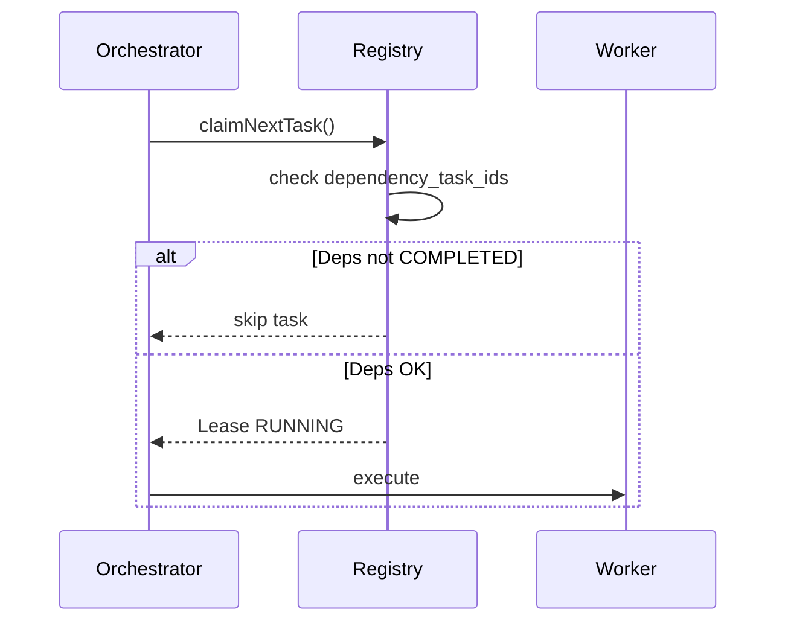

# Prana Library Integration Guide (Client App Edition)

This document is for client applications that integrate Prana as a runtime library.

Goal: make it explicit what your app must provide for each feature to work, including credentials, cloud setup, runtime config, and additional operational data (IDs, mappings, metadata).

## Canonical References

- [../features/index.md](../features/index.md)
- [../features/boot/startup-orchestrator.md](../features/boot/startup-orchestrator.md)
- [../features/storage/governance/rule.md](../features/storage/governance/rule.md)
- [../features/storage/governance/index.md](../features/storage/governance/index.md)
- [../audit/compliance-report.md](../audit/compliance-report.md)

## Host App Preflight Requirements

Before enabling any Prana feature, your client app must provide:

1. Electron main/renderer boundary with preload-only APIs for renderer access.
2. Bootstrap payload flow into `app:bootstrap-host` before protected UI routes.
3. Runtime config payload (`PranaRuntimeConfig`) with required fields populated.
4. Secret injection mechanism (environment variables or external secret manager).
5. Writable local storage locations for SQLite files and vault working directories.
6. Python runtime available in PATH, or `PRANA_EMAIL_PYTHON_COMMAND` set, if Email IMAP ingestion is enabled.

## v1.2 Security Contract

Starting with v1.2, Prana enforces strict security boundaries at the IPC and network layers:

### IPC Payload Validation (Zod)
All IPC handlers validate incoming payloads using Zod schemas via `.safeParse()`. Host apps must send correctly typed payloads — unvalidated or malformed payloads will be rejected with structured error responses. Key schemas:
- `PranaRuntimeConfigSchema` — validates bootstrap config at `app:bootstrap-host`
- Typed payloads on all `app:*` handlers

### Network Timeout Enforcement (wrappedFetch)
All HTTP calls within Prana route through `wrappedFetch` (from `globalFetchWrapper.ts`) which enforces:
- Default timeout via `AbortController`
- No raw `fetch()` calls permitted in any service
- Host apps integrating custom network operations should follow the same pattern

### Filesystem Path Traversal Prevention
All filesystem operations are vault-bounded: `resolvedPath.startsWith(vaultRoot)` is enforced by `virtualDriveProvider.ts`. Files outside defined vault directories cannot be accessed.

### SQLite Encryption at Rest (v1.3)
All SQLite database files (`.sqlite`) are encrypted using **AES-256-GCM** with keys derived via **PBKDF2** (using `vault.archivePassword` and `vault.archiveSalt`). This provides at-rest protection independently of the system drive mount state.

## Required Runtime Config Contract

Prana validates required keys before startup can reach operational state. These fields are mandatory:

- `director.name`
- `director.email`
- `governance.repoUrl`
- `governance.repoPath`
- `vault.archivePassword`
- `vault.archiveSalt`
- `vault.kdfIterations` (integer, minimum 100000)
- `sync.pushIntervalMs` (integer, minimum 30000)
- `sync.cronEnabled` (boolean)
- `sync.pushCronExpression`
- `sync.pullCronExpression`

Common optional groups used by feature integrations:

- `channels.telegramChannelId`
- `google.clientId`
- `google.clientSecret`
- `google.refreshToken`
- `google.adminEmail`
- `branding.*`
- `virtualDrives.*`
- `storage.cacheLocation` (`'local' | 'drive'`, default `'local'`): Controls whether the SQLite config cache follows the mounted virtual drive (`'drive'`) or stays in the home-based app data directory (`'local'`). When set to `'local'`, the config cache is stable and drive-independent. When set to `'drive'`, the config cache relocates to the active system drive mount point after mount.

## Feature Dependency Matrix

| Feature | Required Host Inputs | Additional Data Required | Secrets / Env Vars | External Setup Required | Storage Domains |
| --- | --- | --- | --- | --- | --- |
| Startup + Readiness | Runtime config, bootstrap IPC flow | startup status handling and blocked-state UX mapping | vault archive password and salt via runtime config | none | `runtime_config`, `global_metadata`, `sync_state` |
| Auth | director identity and login UX | session token lifecycle handling, lockout UX | password hash handling (no plaintext persistence) | none | local auth store |
| Storage Core | governance repo settings, vault parameters | app key, domain keys, blueprint mapping | vault cryptographic parameters | governance repo access | `global_metadata`, `app_vault_blueprint` + mirrored vault tree |
| Telegram Channel | channel provider enabled, Telegram channel ID | `chatId`, `senderId`, room mapping, identity map rows | Telegram token and provider credentials outside vault | Bot setup and chat/group capture in Telegram | `conversation_state`, identity mapping |
| Google Ecosystem | google oauth config in runtime payload | file IDs, folder IDs, document types, sync metadata | oauth client secret, refresh token (secret) | Google Cloud project, APIs enabled, OAuth consent screen | `google_workspace_meta`, vault google projection |
| Email | IMAP account config per account | account IDs, UID tracking baseline, pulse schedule profile | `PRANA_EMAIL_APP_PASSWORD_<ACCOUNT_ID>` or `PRANA_EMAIL_APP_PASSWORD`; worker uses `PRANA_IMAP_PASSWORD` internally | mailbox app-password setup (for Gmail, App Password) | `email_artifacts`, `knowledge_documents` |
| Cron Scheduler | scheduler enabled and cron expressions | job IDs, executor target keys, recovery policy | none | none | `cron_scheduler_state` |
| Context + Chat | channel routing availability and model budget policy | conversation IDs, session IDs, thread/reply IDs, digest linkage | provider model keys if external model gateway enabled | none | `conversation_state`, `context_digest`, `llm_cache_index` |

## Additional Data Contract By Feature

This section lists non-secret data your client app must provide in addition to credentials.

### 1. Startup / Bootstrap

Provide:

- Bootstrap payload object with all required runtime keys.
- Client-side handling for readiness states and blocked states.
- UX mapping for integration failures and storage failures (do not hide failures).

Expected state flow:

`INIT -> FOUNDATION -> IDENTITY_VERIFIED -> STORAGE_READY -> STORAGE_MIRROR_VALIDATING -> INTEGRITY_VERIFIED -> OPERATIONAL`

### 2. Telegram / Channel Integration

Provide:

- `telegramChannelId` in runtime channel configuration.
- Inbound payload fields: `senderId`, `senderName`, `chatId`, `messageText` (or `message`), optional `sessionId`.
- Optional targeting fields: `explicitTargetPersonaId`, `isDirector`, `metadata`.
- Identity-mapping data to link external Telegram user identity to internal operator identity.

Notes:

- Telegram adapter supports groups and uses `chatId` as room/account context.
- Telegram token must not be stored in vault artifacts.

- `google.refreshToken`
- `google.adminEmail`

Cloud prerequisites:

1. Create Google Cloud project and enable APIs (Drive, Sheets, Docs, Forms).
2. Configure OAuth consent screen with `http://localhost:3111` as a valid redirect URI.
3. Prana uses an **ephemeral OAuth server** on Port 3111 to capture the authorization code during the initial handshake.
4. Native `fetch()` REST gateways are used for all operations (zero-dependency).

### 4. Email Integration (IMAP Pulse)

Provide:

- Per-account runtime data: `accountId`, `address`, `imapHost`, `imapPort`, `useTls`, `lastReadUID`.
- UID baseline and account-level dedup expectations.
- Scheduler cadence profile for polling.

Required secrets and runtime variables:

- Preferred env var: `PRANA_EMAIL_APP_PASSWORD_<ACCOUNT_ID_NORMALIZED>`.
- Fallback env var: `PRANA_EMAIL_APP_PASSWORD`.
- Optional python command override: `PRANA_EMAIL_PYTHON_COMMAND`.

Notes:

- Email worker expects password via `PRANA_IMAP_PASSWORD` internally, injected by main process service.
- Never persist mailbox passwords in vault documents.

- Job definitions: `id`, `name`, `expression`, `target`, `status`, `recovery_policy`.
- Recovery policy per job: `SKIP`, `RUN_ONCE`, or `CATCH_UP`.
- **Advanced Features (v1.3):**
  - **DAG Dependencies:** Tasks can specify `dependency_task_ids` in `payloadMeta`. The orchestrator will not claim a task until all dependencies are `COMPLETED`.
  - **Adaptive Throttling:** If a lane encounters >5 failures, its parallelism is dynamically throttled to 0 (Circuit Breaker).
  - **Dead Letter Queue (DLQ):** Tasks that exhaust retries are moved to `DLQ` state for manual inspection.

### 6. Storage Governance

Provide:

- App contract docs before implementation:
  - `docs/features/storage/governance/cache/<app>.md`
  - `docs/features/storage/governance/vault/<app>.md` (only when vault persistence is needed)
- Stable domain keys and cache-vault mirror mapping.
- Ownership model data: `app_registry` and `app_id` usage in app-specific cache tables.

Rules:

1. Cache-only app setup is allowed.
2. Vault-only app setup is not allowed.
3. Every vault domain key must have matching cache domain key.

### 7. Context / Communication

Provide:

- Conversation and message identifiers: `conversation_id`, `session_key`, `message_id`, optional `reply_to_message_id`.
- Operator/channel identity mapping keys.
- Metadata envelope needed by routing and audit.
- Token-budget policy inputs for compaction strategy.

## Secrets And Security Boundaries

Do not store these in vault documents:

- Telegram bot tokens and provider credentials.
- Email app passwords.
- Google OAuth client secrets and refresh tokens.

Recommended handling model:

1. Store secrets in host secret manager or environment injection layer.
2. Inject only at runtime startup.
3. Keep secret usage in-memory and avoid persistence to vault or logs.
4. Persist only structured operational artifacts to cache and vault.

## Integration Runbook (Client Team)

1. Prepare storage contracts under governance docs.
2. Prepare runtime config with all required mandatory fields.
3. Configure secret injection for Telegram/Google/Email credentials.
4. Bootstrap host app and verify integration readiness keys pass validation.
5. Verify startup state reaches `OPERATIONAL`.
6. Enable and smoke-test each feature in sequence:
   - Storage and sync
   - Channel routing
   - Google sync
   - Email ingestion
   - Scheduler and recovery
7. Validate audit/compliance reporting and blocked-state UX paths.

## Troubleshooting By Feature

### Startup blocked before operational

- Check required runtime fields are present and valid.
- Check vault KDF iterations and sync interval minimums.
- Check governance repo path and URL are reachable.

### Telegram route unavailable

- Check `channels.telegramChannelId` is configured.
- Check inbound payload contains `chatId` and `senderId`.
- Check runtime channel configuration and provider credentials.

### Google bridge not syncing

- Check OAuth credentials and refresh token validity.
- Check Google Cloud APIs and consent configuration.
- Check metadata persistence in workspace sync state.

### Email fetch failing

- Check account-specific password env var first.
- Check fallback env var and Python command availability.
- Check IMAP host, port, TLS, and account UID baseline.

### Scheduler not executing jobs

- Check scheduler enabled and cron expressions.
- Check startup readiness gates completed.
- Check executor target keys are registered.

## Quick Links

- Feature index: [../features/index.md](../features/index.md)
- Startup orchestrator: [../features/boot/startup-orchestrator.md](../features/boot/startup-orchestrator.md)
- Email: [../features/email/email.md](../features/email/email.md)
- Communication: [../features/chat/communication.md](../features/chat/communication.md)
- Google integration: [../features/Integration/google-ecosystem-integration.md](../features/Integration/google-ecosystem-integration.md)
- Storage governance rules: [../features/storage/governance/rule.md](../features/storage/governance/rule.md)
- Prana cache contract: [../features/storage/governance/cache/prana.md](../features/storage/governance/cache/prana.md)
- Prana vault contract: [../features/storage/governance/vault/prana.md](../features/storage/governance/vault/prana.md)
- Compliance baseline: [../audit/compliance-report.md](../audit/compliance-report.md)
